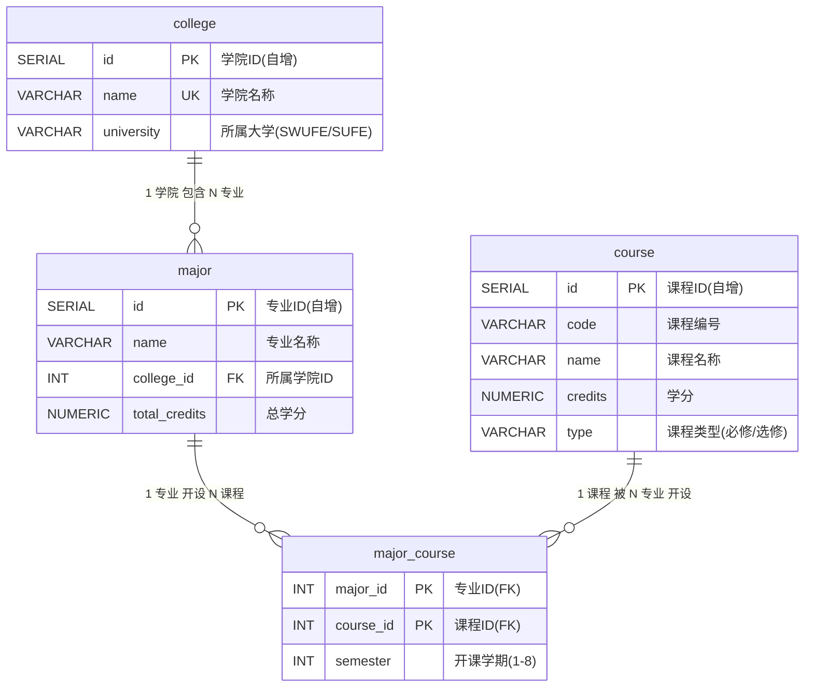

# 数据库 ER 图

## 关系说明

| 关系 | 基数 | 说明 |
|:---|:---|:---|
| college → major | 1:N | 一个学院下有多个专业 |
| major → major_course | 1:N | 一个专业开设多门课程 |
| course → major_course | 1:N | 同一门课可被多个专业开设 |

## 你可以用 draw.io 打开

1. 打开 https://app.diagrams.net/
2. 新建空白图 → 左侧搜 "Entity Relation" 模板
3. 按上表拖入 4 个实体、3 条关系线
4. 导出为 PNG 插到报告里
